Orc.Controls
===============

[](https://gitter.im/WildGums/Orc.Controls?utm_source=badge&utm_medium=badge&utm_campaign=pr-badge&utm_content=badge)


This library contains simple (yet useful) controls for viewing and editing data, such as:

- **DatePickerControl**
- **DateTimePickerControl**
- **TimeSpanControl**
- **BindableRichTextBox**
- **DropDownButton**
- **FilterBoxControl**
- **LogViewer**
- **WatermarkTextBox**
- **LinkLabel**
- **OpenFilePickerView**
- **DirectoryPickerView**
- **SaveFilePickerView**

Run the demo project to see the controls in action:

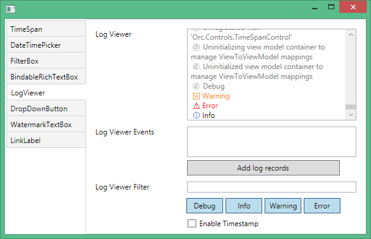

DatePickerControl
----------------------
This control looks like a regular DatePicker but allows you to edit a date quickly.

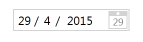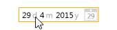

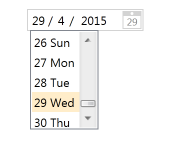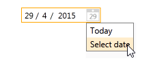

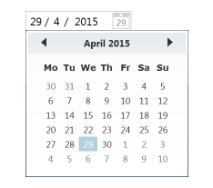

Double click on any number to start editing. Press the “Tab” key to move to the next number.

Click on a letter to display a drop down list to choose from.

### How to use DatePickerControl

Bind a *DateTime* value to the **Value** property:

```
    <orc:DatePickerControl Value="{Binding DateValue}" />
```

DateTimePickerControl
----------------------

This control is used to display and edit DateTime data quickly.

 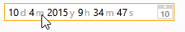

 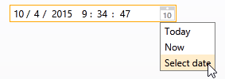 


Double click on any number to start editing. Press the "Tab" key to move to the next number.

Click on a letter to display a drop down list to choose from.

### How to use DateTimePickerControl

Bind a *DateTime* value to the **Value** property:

```
    <orc:DateTimePickerControl Value="{Binding DateTimeValue}" />
```

TimeSpanControl
------------------

This control is used to display and edit TimeSpan values. 
By default it will display the value using the *dd.hh:mm:ss* format.

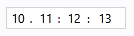 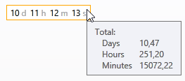

When hovering over the control, the tooltip will display the timespan in total number of days, hours and minutes.

Double click on any of the *d*, *h*, *m* or *s* letters, to edit the TimeSpan value with the specified unit of measure. (i.e. days, 

hours, minutes, seconds)

 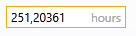 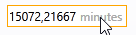

### How to use TimeSpanControl

Bind a *TimeSpan* value to the **Value** property:

```
	<orc:TimeSpanControl Value="{Binding TimeSpanValue}"/>
```

BindableRichTextBox
---------------------

The control can be used as a regular [RichTextBox](https://msdn.microsoft.com/en-us/library/system.windows.controls.richtextbox

(v=vs.110).aspx) with one added advantage. It can be bound to a [FlowDocument](https://msdn.microsoft.com/en-

us/library/system.windows.documents.flowdocument(v=vs.110).aspx). 

It is very useful to use with the MVVM pattern.

### How to use BindableRichTextBox

For binding data to the *BindableRichTextBox*, use the *BindableDocument* property  (the type is [FlowDocument]

(https://msdn.microsoft.com/en-us/library/system.windows.documents.flowdocument(v=vs.110).aspx)):

```
    <orc:BindableRichTextBox BindableDocument="{Binding FlowDoc}" />
```

Once that is done you may assign a new value to it or change the layout of the  [FlowDocument](https://msdn.microsoft.com/en-

us/library/system.windows.documents.flowdocument(v=vs.110).aspx). 

Everything will automatically be displayed in your UI.

DropDownButton
---------------

The control is made up of two buttons side by side. The First button works as a regular button and the second one will display a customizable drop down menu under the control. 

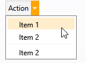

### How to use DropDownButton

The control has three main bindable properties which can be used to configure the DropDownButton behavior:

- **Header** => caption of Button
- **Command** => used to configure the default action
- **DropDown** => the ContextMenu

```    
<orc:DropDownButton Header="Action" Command="{Binding DefaultAction}">
	<orc:DropDownButton.DropDown>
		<ContextMenu>
			<MenuItem Header="Item 1"/>
			<MenuItem Header="Item 2"/>
			<Separator/>
			<MenuItem Header="Item 2"/>
		</ContextMenu>
	</orc:DropDownButton.DropDown>
</orc:DropDownButton>
```

FilterBoxControl
-----------------

Looks like a regular TextBox. 

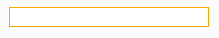

Start typing and you will see a drop down list with possible matches. The drop down list will automatically update itself as you are 

typing.

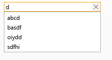

Click on the 'x' button to reset the text box.

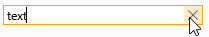

### How to use FilterBoxControl

The bindable properties are:

* **FilterSource** => The collection of items shown in the drop down list
* **PropertyName** => The name of the property you want to use to filter the items in the collection with.
* **Text** => The text entered by the user, which is used to filter the items in the *FilterSource* collection

```
<orc:FilterBoxControl PropertyName="Value" 
	              FilterSource="{Binding FilterSource}" 
	              Text="{Binding FilterText}"/>
```

LogViewer
----------

This control is used to display log messages generated from an application in real time. The  Control uses it's own LogListener, 

which is derived from [Catel.Logging.LogListenerBase](http://www.nudoq.org/#!/Packages/Catel.Core/Catel.Core/LogListenerBase). 

A [RichTextBox](https://msdn.microsoft.com/en-us/library/system.windows.controls.richtextbox(v=vs.110).aspx) is used to display the 

log messages.

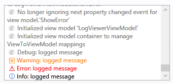

### How to use LogViewer

Here are the main properties, which are used to configure the LogViewer control:

Filtering: 

- **LogFilter** => string. Used for filtering the log records with a search term.
- **ShowDebug** => boolean. Show debug log records if true.
- **ShowInfo** => boolean. Show info log records if true.
- **ShowWarning** => boolean. Show warning log records if true.
- **ShowError** => boolean. Show error log records if true.
 
Visualisation:

- **EnableTimestamp** => boolean. Show timestamp for each log record if true.
- **EnableTextColoring** => boolean. Show colors for each log record depending on its log level.
- **EnableIcons** => boolean. Show the icon associated with each log record. The icon will change depending on the log level.

Events:

- **LogEntryDoubleClick** => Allow you to subscribe to a user double clicking on a record.

```
<orc:LogViewerControl LogEntryDoubleClick="LogViewerControlOnLogRecordDoubleClick
			LogFilter="{Binding Text, ElementName=FilterTextBox}"
			ShowDebug="{Binding IsChecked, ElementName=ShowDebugToggleButton}"
			ShowInfo="{Binding IsChecked, ElementName=ShowInfoToggleButton}"
			ShowWarning="{Binding IsChecked, ElementName=ShowWarningToggleButton}"
			ShowError="{Binding IsChecked, ElementName=ShowErrorToggleButton}"
			EnableTimestamp="{Binding IsChecked, ElementName=EnableTimestampCheckBox}"
			EnableTextColoring="True" 
			EnableIcons="True"/>
```

WatermarkTextBox
---------------------

This control will display a watermark in a textbox control when no value is assigned to it.
As soon as the user starts typing in the textbox the watermark will disappear.

This control is useful to add hints.

A watermark can contain text or any other control such as images:

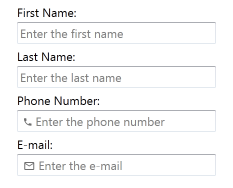

### How to use WatermarkTextBox

In order to use the simple watermark just set a watermark value to the *Watermark* property: 

```
<orc:WatermarkTextBox Watermark="Textbox with Watermark" />
```

In order to add controls or images to the watermark you can define a watermark value like this: 

```
<orc:WatermarkTextBox>
    <orc:WatermarkTextBox.Watermark>
        <StackPanel Orientation="Horizontal">
            <Image Source="/Resources/Images/email.png" />
            <TextBlock Text="Enter the e-mail" />
        </StackPanel>
    </orc:WatermarkTextBox.Watermark>
</orc:WatermarkTextBox>
```

LinkLabel
----------

This control is a label which looks and bahaves like a hyperlink.

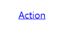

###How to use LinkLabel

```
<orc:LinkLabel Content="Action" ToolTip="Action" Command="{Binding DefaultAction}"
                       HoverForeground="Orange" Url="http://catelproject.com"
                       ClickBehavior="OpenUrlInBrowser"/>
```

The bindable properties are:

- **Url** => The URL.
- **HyperlinkStyle** => The hyperlink style.
- **HoverForeground** => The hover foreground. 
- **LinkLabelBehavior** => The link label behavior. Can be SystemDefault, AlwaysUnderline, HoverUnderline, NeverUnderline.
- **ClickBehavior** => The click behavior. Can be OpenUrlInBrowser or Undefined.
- **Command** => The command.
- **CommandParameter** => The command parameter.
- **CommandTarget** => The command target.

OpenFilePickerView
----------

This control allows user to choose an existing file directory.

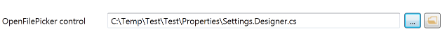

###How to use OpenFilePickerView

```
<orc:OpenFilePickerView LabelText="OpenFilePicker control" LabelWidth="150" />
```

The bindable properties are:

- **LabelWidth** => The label width.
- **LabelText** => The label content.
- **SelectedFile** => The selected file path. 

DirectoryPickerView
----------

This control allows users to choose a directory.

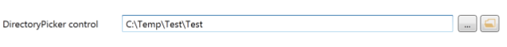

###How to use DirectoryPickerView

```
<orc:DirectoryPickerView LabelText="DirectoryPicker control" LabelWidth="150" />
```

The bindable properties are:

- **LabelWidth** => The label width.
- **LabelText** => The label content.
- **SelectedDirectory** => The selected directory. 

SaveFilePickerView
----------

This control allows user to choose a directory where a file will be saved.

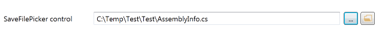

### How to use SaveFilePickerView

```
<orc:SaveFilePickerView LabelText="SaveFilePicker control" LabelWidth="150" />
```

The bindable properties are:

- **LabelWidth** => The label width.
- **LabelText** => The label content.
- **SelectedFile** => The selected file path.
- **Filter** => The filter string that determines what types of files are displayed from the SaveFileDialog .

## Links

- Orc.Controls is part of the [Orchestra](https://github.com/WildGums/Orchestra) family of controls.
- Other similar open source controls can be found [here](https://github.com/objorke/PropertyTools)
